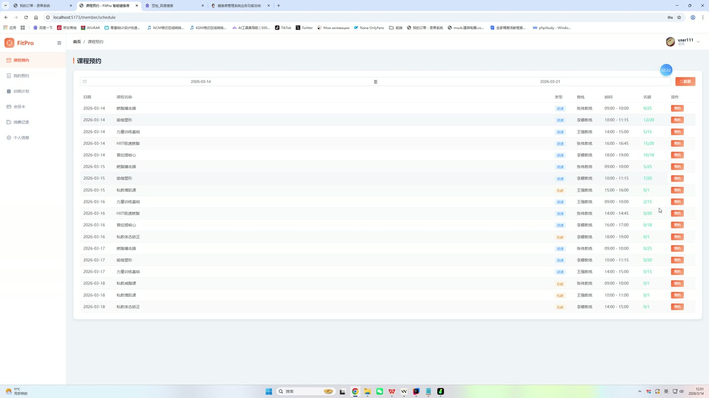
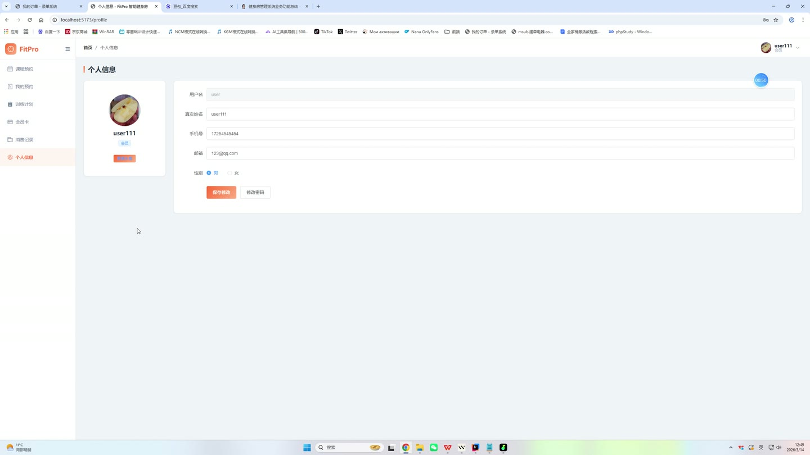
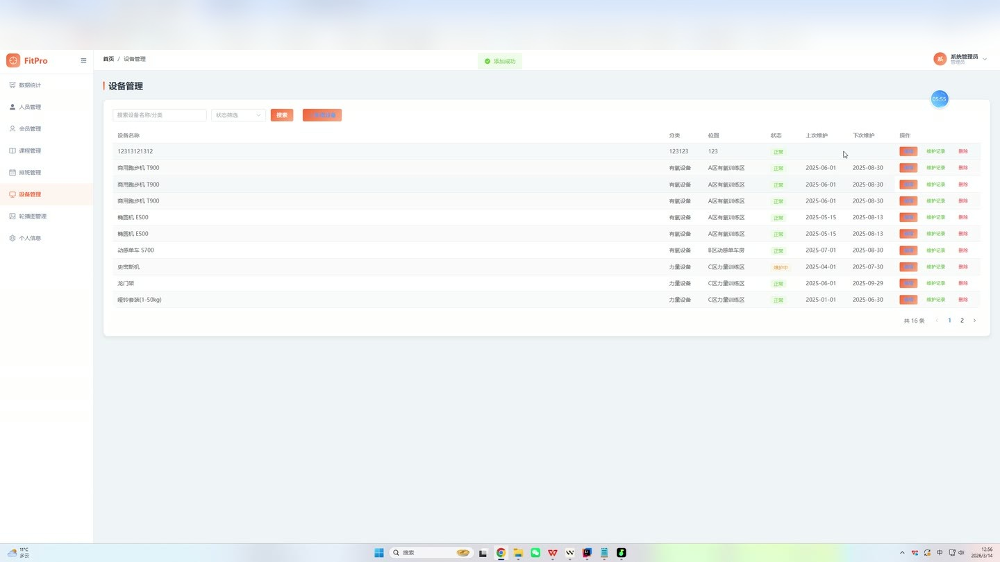
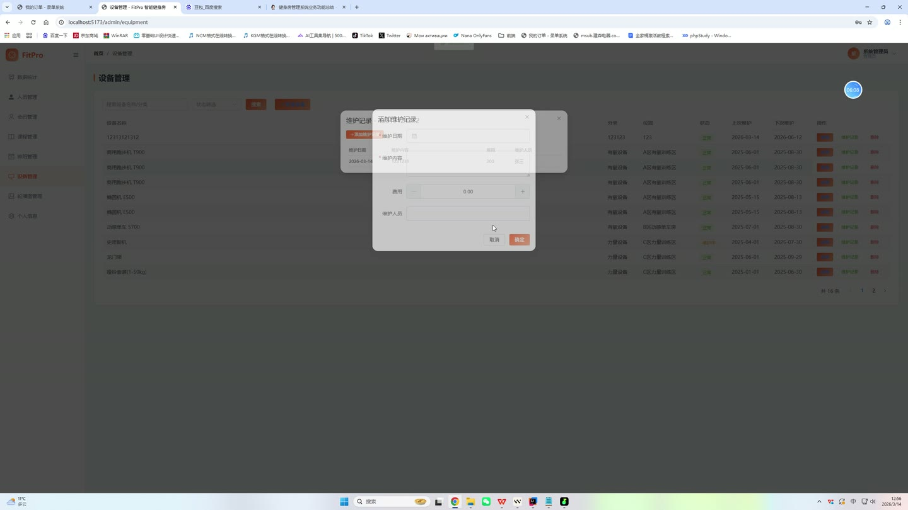
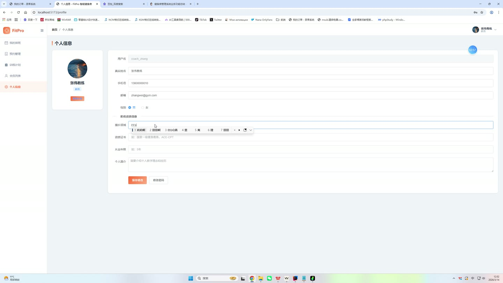

# (附文档)Springboot3+Vue3+MySQL 健身房管理系统

**技术栈**：Springboot3、Vue3、MySQL

### 系统简介

本系统是一套基于 Spring Boot 3 + Vue 3 前后端分离的健身房综合管理平台，支持普通用户、教练、管理员三种角色。用户可在线购买会员卡与课程、预约教练、管理健身计划并打卡；教练可管理课程与排期、处理预约、回复评价并查看收入统计；管理员负责用户与教练审核、会员卡配置、订单退款处理、内容管理（Banner/FAQ/训练技巧）以及系统日志审计。
 
### 核心功能
 
### 普通用户端

 
- 注册账号（填写用户名、密码、昵称、手机号），登录后获取 JWT Token 
- 查看个人信息，修改昵称、手机号、邮箱、性别、头像、个人简介 
- 浏览公开教练列表（仅显示审核通过且启用的教练），查看教练详情（包含其课程与用户评价） 
- 按分类筛选课程列表，查看课程详情（含教练信息、排期时段、用户评价） 
- 购买会员卡：选择会员卡类型（时长/价格），下单后自动生成订单并激活会员身份 
- 购买课程：选择课程与购买课时数，生成课程订单并记录剩余课时 
- 预约课程：选择已购课程订单与可用排期时段，提交预约申请（扣减排期名额） 
- 查看我的预约列表（状态：待确认/已确认/已拒绝/已完成），显示课程名称、教练、时间 
- 查看我的会员订单与课程订单，支持提交退款申请（状态变更为退款中） 
- 创建健身计划（标题、描述、起止日期），支持编辑与删除 
- 每日训练打卡：记录训练日期、时长（分钟）、备注内容 
- 查看打卡统计：累计天数、总训练时长、近7天每日打卡情况 
- 对已上课程提交评价（评分、内容），评价自动关联课程与教练 
- 浏览训练技巧文章（按身体部位筛选），查看技巧详情（含封面、内容、视频链接） 
- 查看常见问题（FAQ）列表，按分类展示问答内容
 
### 教练端

 
- 修改个人资料：昵称、手机号、头像、擅长领域、个人简介、资质证书 
- 管理课程：创建新课程（标题、封面、描述、价格、总课时、分类），编辑已创建课程 
- 查看自己所有课程列表，仅可操作本人创建的课程 
- 管理课程排期：创建排期（选择课程、日期、开始/结束时间、最大人数），编辑或停用排期 
- 查看所有排期列表（含课程名称、日期、时间、已预约人数/最大人数、状态） 
- 处理预约请求：确认预约（自动扣减学员课程订单的剩余课时）、拒绝预约（释放排期名额）、完成预约（可填写备注） 
- 查看收到的评价列表（评分、内容、用户昵称、课程名称），可回复评价 
- 查看收入统计：总收入、学员总数、总预约次数、已完成预约次数、订单数量
 
### 管理员端

 
- 用户管理：分页查询用户列表（按用户名/昵称搜索，按角色筛选），修改用户信息（昵称、手机号、邮箱、角色、状态），启用/禁用用户账号 
- 教练管理：查看所有教练账号，审核教练身份（通过/驳回） 
- 会员卡管理：创建会员卡类型（名称、类型、时长天数、价格、描述），编辑或删除会员卡类型，控制上下架状态 
- 课程审核：查看所有课程列表（含教练名称），审核课程状态（上架/下架） 
- 订单管理：分页查看会员订单与课程订单（按状态筛选），处理退款申请（变更订单状态） 
- 评价管理：查看所有用户评价（含评分、内容、用户、课程），修改评价显示状态 
- 训练技巧管理：创建/编辑/删除训练技巧文章（标题、身体部位、封面、内容、视频链接），控制上下架状态 
- FAQ管理：创建/编辑/删除常见问题（问题、答案、分类、排序），控制显示状态 
- Banner管理：创建/编辑/删除首页轮播图（标题、图片链接、跳转链接、排序），控制显示状态 
- 系统日志：查看操作日志列表（用户、操作描述、请求方法、IP地址、时间）
 
### 技术栈

 后端框架Spring Boot 3.x ORMMyBatis-Plus（自动分页、Lambda 查询） 权限认证Spring Security + JWT（无状态 Token） 前端框架Vue 3（Composition API） 状态管理Pinia 构建工具Vite 数据库MySQL 8.x（含完整初始化 SQL） 密码加密BCryptPasswordEncoder 文件上传MultipartFile 本地存储（可配置路径）
 
### 交付内容

 
- 后端完整源码 
- 前端完整源码 
- 数据库初始化脚本 
- 万字文档

## 界面展示

---

## 获取完整源码 + 万字文档

本仓库为项目介绍页。**完整前后端源码、数据库初始化脚本、万字项目文档**，请加微信 `kangkangcode`，或访问 [codekk.top](http://codekk.top) 获取。

可作课程设计 / 毕业设计参考，支持远程部署调试。